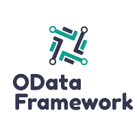

# odata-fw

> An abap odata framework.

## Description

An OData ABAP Framework, that focuses on a easy and fast way to create OData Services in ABAP. Changes to the OData service are done in the code for data changes and in the customizing for model changes, no need to regenerate the service after changes.
Every entity has it own class, therefore every class can be reused in entities of other services. 
It also reduces the mainly unused `CRUD` methods that the `SEGW` will create for every entity.
The purpose of this framework is to create a simple Odata service within a few minutes. 
Every service that uses this framework can easy be extended.

## Documentation
The documentation and how to use can be found under [Documentation](https://miggi92.github.io/odata-fw/)

## Contributing

Comments and suggestions for improvements are welcome.

More details can be found at [Contributing](./CONTRIBUTING.md).

## License

Please see our [LICENSE](./LICENSE.md) for copyright and license information.

## Download & Installation

Pull the source code with [abapGit](https://github.com/abapGit/abapGit/) into your ABAP system. The latest abapGit build can be downloaded [here](https://raw.githubusercontent.com/abapGit/build/main/zabapgit.abap).

## Sponsors

