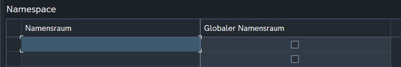
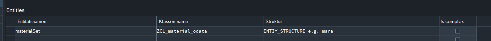

# OData Customizing

## Transaction

Transactioncode: **ZODATA_CUST**

> [!info]
> This transaction is calling the "SM34" transaction code with the view cluster name.
> So make sure, that you have the permissions to change entries in the view cluster "ZODATA_VC".

## Create namespace

To create a namespace, just enter the namespace you want to use and define weather it is a [global namespace](OData%20Customizing.md#global-namespace) or not. The name should match the name that you used in the [DPC](DPC.md#) and [MPC](MPC.md#) framework methods mention in the [Creating a service](./Creating%20a%20service.md#) file ([Implement the framework MPC method](./Creating%20a%20service.md#implement-the-framework-mpc-method) / [Implementing the framework DPC methods](./Creating%20a%20service.md#implementing-the-framework-dpc-methods) )

### global namespace

A global namespace is appended to **every** OData Service that is using this framework. It might be useful for some global entities such as a "document" entity. 

## Define entities

To define entities you need to select the namespace you want to define an entity for.

The classes added to the customizing should inherit from "[ZCL_ODATA_MAIN](ZCL_ODATA_MAIN.md#)" class..

## Define properties

