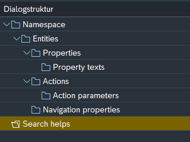

#  {{ $frontmatter.title }}

Search helps are currently ment to be global available. But the search help entity will only be generated if any property has an value in the "search help" column.

Every search help entity will have 2 properties:
- value
- description

## Fixed domain values

The fixed domain values can be created as a value help with following customizing:

So to get it to work you only need to enter the data element into the "data_element" column.

The framework automatically propergates the values.

In the example the value help enity will be: **fixedDomainValueHelpSet**
