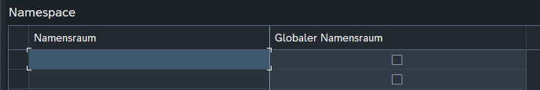
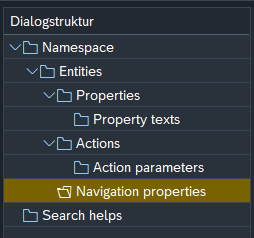

#  {{ $frontmatter.title }}

## Transaction

Transactioncode: **ZODATA_CUST**

> [!info]
> This transaction is calling the "SM34" transaction code with the view cluster name.
> So make sure, that you have the permissions to change entries in the view cluster "ZODATA_VC".

## Create Namespace

To create a namespace, just enter the namespace you want to use and define weather it is a [global namespace](#global-namespace) or not. The name should match the name that you used in the [DPC](../definitions/DPC) and [MPC](../definitions/MPC) framework methods mention in the [Creating a service](../Creating-a-service) file ([Implement the framework MPC method](../Creating-a-service#implement-the-framework-mpc-method) / [Implementing the framework DPC methods](../Creating-a-service#implementing-the-framework-dpc-methods) )

  

### Global Namespace

A global namespace is appended to **every** OData Service that is using this framework. It might be useful for some global entities such as a "document" entity.

## Define Entities

To define entities you need to select the namespace you want to define an entity for.

The classes added to the customizing should inherit from "[ZCL_ODATA_MAIN](./dev-objects/classes/ZCL_ODATA_MAIN)" class.

## Define Properties

>[!warning]
>Still not documented

## Navigation Properties / Associations

A navigation property also known as association can easily be created via customizing. The navigation properties are defined under an entity. 

Just enter the navigation property name, the entity you want to navigate from and the entity you want to navigate to and at least the relation of that navigation.

