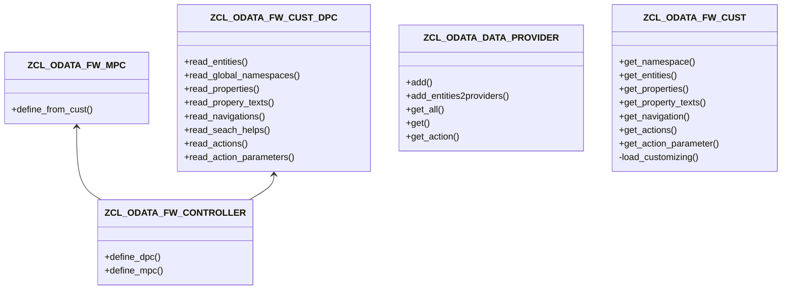

# Classes

## Class Documentations

### Framework classes

1. [[ZCL_ODATA_FW_CONTROLLER]]
1. [[ZCL_ODATA_FW_MPC]]
1. [[ZCL_ODATA_FW_CUST_DPC]]
1. [[ZCL_ODATA_DATA_PROVIDER]]
1. [[ZCL_ODATA_FW_CUST]]

#### UML

### Helper classes

  1. [[ZCL_ODATA_MAIN]]
  1. [[ZCL_ODATA_DOCUMENTS]]
