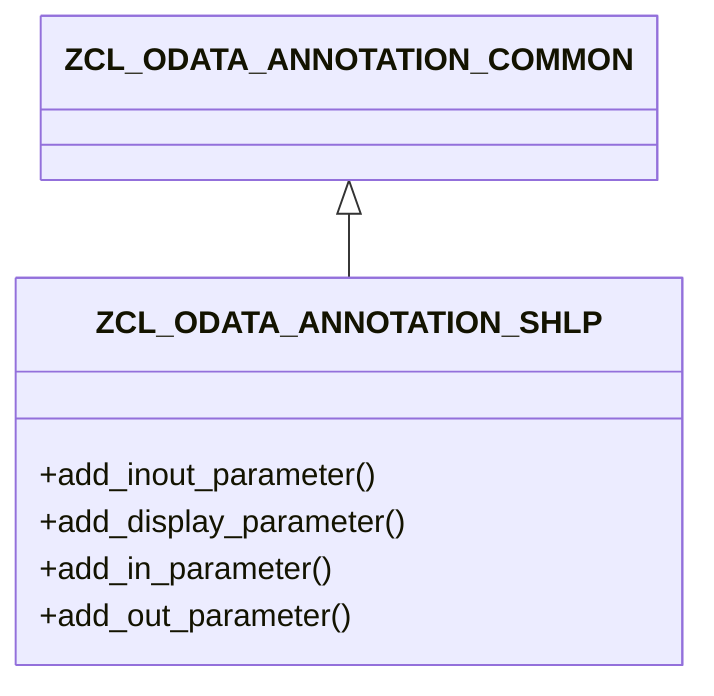

#  {{ $frontmatter.title }}

## Class UML

```mermaid
classDiagram

	ZCL_ODATA_ANNOTATION_COMMON <|-- ZCL_ODATA_ANNOTATION_SHLP

	class ZCL_ODATA_ANNOTATION_COMMON{
	}

	class ZCL_ODATA_ANNOTATION_SHLP{
		+add_inout_parameter()
		+add_display_parameter()
		+add_in_parameter()
		+add_out_parameter()
	}

```

